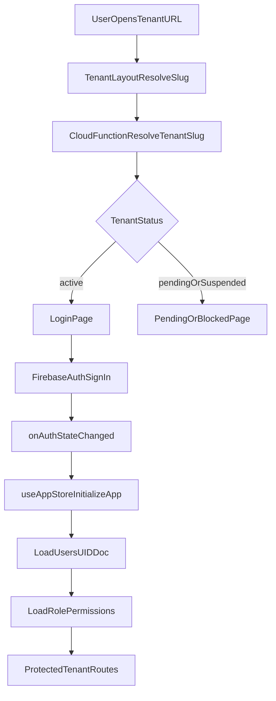
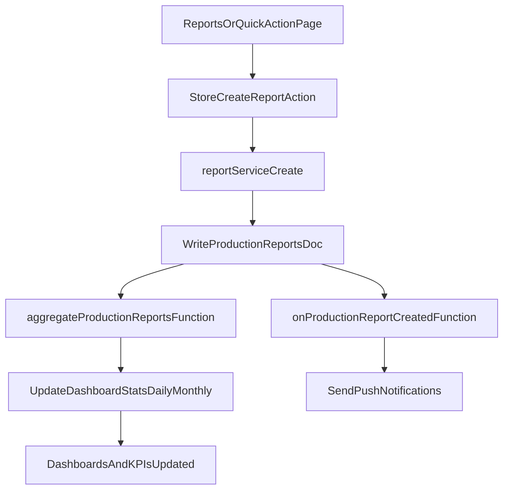
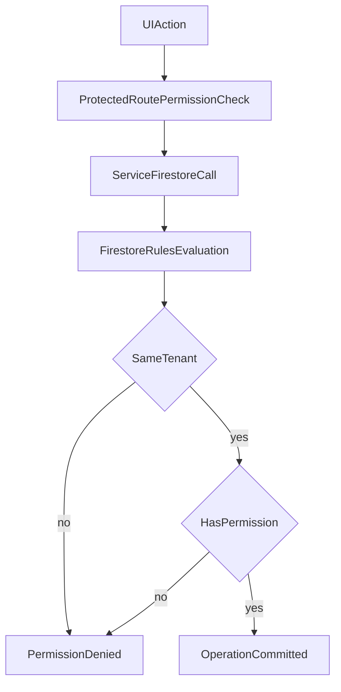

# توثيق شامل للمشروع

## 1) ما هو هذا المشروع؟

هذا المشروع هو نظام ERP تشغيلي للمصنع مبني حول دورة الإنتاج اليومية الفعلية، وليس مجرد نظام تقارير.  
النظام يجمع في منصة واحدة:

- إدارة الإنتاج (خطط، أوامر شغل، تقارير، إدخال سريع).
- إدارة الجودة (فحص نهائي، IPQC، CAPA، إعادة التشغيل).
- إدارة المخازن والتحويلات والجرد.
- إدارة الموارد البشرية والرواتب والموافقات.
- إدارة التكاليف الشهرية والانحرافات والأصول والإهلاك.
- إدارة الصيانة (Repair) كمسار أعمال كامل: طلب -> تنفيذ -> قطع غيار -> خزينة -> فاتورة.
- إدارة النظام (مستخدمين، أدوار، صلاحيات، إعدادات، سجل نشاط).

باختصار: النظام يحول التشغيل الصناعي من ملفات منفصلة وقرارات فردية إلى منصة موحدة قابلة للتتبع والتحليل.

---

## 2) المشكلة التي يحلها المشروع

قبل النظام، أغلب المصانع تعاني من نفس النمط:

- البيانات موزعة بين Excel ودفاتر وواتساب.
- لا يوجد رقم موحد "حقيقي" للإنتاج اليومي يمكن الوثوق به.
- تضارب بين الإنتاج والجودة والمخازن والموارد البشرية.
- صلاحيات الوصول غير منضبطة (أي شخص يعدل أي شيء).
- صعوبة معرفة: من عدّل؟ متى؟ ولماذا؟
- تأخر في القرارات الإدارية بسبب غياب لوحة لحظية موحدة.

### كيف يحلها النظام؟

- **مصدر بيانات واحد**: Firestore كمخزن مركزي لكل الوحدات.
- **صلاحيات دقيقة**: RBAC ديناميكي مرتبط بالأدوار والصلاحيات.
- **تدفق عمل مؤسسي**: موافقات، تفويضات، تصعيد، وتدقيق.
- **ترابط وحدات**: تقرير الإنتاج يؤثر على الإحصاءات، الجودة، والتنبيهات.
- **تشغيل متعدد الشركات**: نفس النظام يخدم عدة شركات بعزل بيانات كامل لكل Tenant.

### القيمة التجارية المباشرة

- تقليل فاقد الوقت في الإدخال اليدوي وتجميع التقارير.
- تحسين جودة القرار بوجود KPIs لحظية.
- تقليل الأخطاء التشغيلية الناتجة عن تضارب البيانات.
- رفع مستوى الحوكمة (Auditability + Traceability).

---

## 3) ما الذي يقدمه النظام وظيفيًا؟ (Module Map)

الوظائف الأساسية واضحة من `config/menu.config.ts`:

- **Dashboards**: الصفحة الرئيسية ولوحات حسب الدور.
- **Catalog**: منتجات، مواد خام، فئات.
- **Production**: خطوط إنتاج، خطط، أوامر شغل، تقارير، إدخال سريع، توزيع مشرفين وعمال.
- **Inventory**: أرصدة، حركات، تحويلات، جرد، اعتمادات تحويل.
- **HR**: موظفين، إجازات، سلف، تقييم، Payroll، الخدمة الذاتية.
- **Attendance**: سجلات خام، حضور يومي، مزامنة أجهزة.
- **Costs**: تكلفة شهرية، مراكز تكلفة، أصول، تقارير الإهلاك.
- **Quality**: فحص، عيوب، إعادة تشغيل، CAPA، تقارير جودة.
- **Repair**: Dashboard، وظائف الصيانة، قطع غيار، فروع، خزينة، فواتير.
- **System**: مستخدمين، أدوار، سجل نشاط، إعدادات.

هذا التقسيم مهم لأنه يجعل كل وحدة تتطور بشكل مستقل نسبيًا مع التزامها بنفس قواعد الهوية والصلاحيات.

---

## 4) كيف تم إنشاء النظام تقنيًا؟ (Construction Stack)

من `package.json` و`vite.config.ts`:

- **Frontend**: React 19 + TypeScript + Vite.
- **Routing**: `react-router-dom` مع هيكل مسارات Modular.
- **State Management**: Zustand (`store/useAppStore.ts`) كـ Orchestration Layer.
- **Data/Auth/Storage**: Firebase (Auth + Firestore + Storage).
- **Backend Logic**: Firebase Cloud Functions (`functions/src/index.ts`).
- **PWA**: عبر `vite-plugin-pwa` (Service Worker + Manifest + Runtime caching).
- **Charts/Export/Print**: Recharts + xlsx + jsPDF + html2canvas + react-to-print.

### لماذا هذا الاختيار مناسب؟

- React + Zustand مناسبين لواجهة كثيفة الشاشات والتفاعلات.
- Firebase يقلل كلفة إدارة السيرفر التقليدي في نظام داخلي سريع التطوير.
- Cloud Functions تستوعب عمليات الخلفية الحساسة (صلاحيات، حذف عميق، جدولة، إرسال Push).

---

## 5) الهيكل المعماري العام

المركز الحقيقي للتطبيق: `App.tsx` + `useAppStore.ts`.

- `App.tsx` يجمع كل المسارات، يطبق الحماية، ويدير Tenant gate.
- `useAppStore.ts` يدير:
  - التمهيد بعد تسجيل الدخول.
  - تحميل البيانات الرئيسية.
  - بناء الحالة المجهزة للواجهة.
  - عمليات CRUD عبر Services.
  - بعض منطق الأعمال المشترك (تكلفة، ربط أوامر، تنبيهات...).
- `services/*` و`modules/*/services/*` طبقة الربط مع Firestore/Functions.
- `functions/src/index.ts` يعالج المنطق الخلفي الذي لا يجب تنفيذه من العميل.

---

## 6) منطق الربط الكامل (Frontend <-> Firebase <-> Functions)

## 6.1 واجهة ومسارات

في `App.tsx`:

- يتم تجميع مسارات الوحدات (`*_ROUTES`) في قائمة Protected واحدة.
- كل Route محمي بـ `ProtectedRoute` ويحتاج Permission محدد.
- المسارات العامة للمصادقة مستقلة داخل `AUTH_PUBLIC_ROUTES`.
- التطبيق يعمل بمفهوم الشركة داخل رابط: `/t/:tenantSlug/...`.

## 6.2 هوية + Tenant Resolution

عند زيارة رابط شركة:

1. `TenantLayout` يستدعي `tenantService.resolveSlug`.
2. `resolveSlug` يعتمد على callable `resolveTenantSlug` (Cloud Function عامة).
3. يتم تحديد حالة الشركة:
   - active -> استكمال الدخول.
   - pending/inactive/suspended -> شاشة مناسبة.
   - slug خاطئ أو شركة أخرى -> منع وإعادة توجيه.

## 6.3 تهيئة الجلسة

تدفق المصادقة الأساسي:

1. `onAuthChange` يلتقط دخول المستخدم.
2. `initializeApp()` من `useAppStore` يقرأ `users/{uid}`.
3. يتحقق من `isActive`، ثم يحمل `role` وصلاحياته.
4. يحمّل بيانات التشغيل الأولية للوحدات.
5. يفتح الواجهة حسب صلاحيات الدور.

## 6.4 طبقة البيانات

الخدمات (`services`, `modules/*/services`) مسؤولة عن:

- التفاعل مع collections.
- توحيد أخطاء Firebase.
- عزل تفاصيل التخزين عن الصفحات.

الصفحات لا تتعامل عادة مع Firestore مباشرة؛ تتعامل مع Store/Services.

---

## 7) Multi-Tenant: العزل بين الشركات

المشروع Multi-tenant فعليًا وليس شكليًا:

- تعريف الشركة داخل `tenants` وربط slug داخل `tenant_slugs`.
- تسجيل شركة جديدة يمر عبر `pending_tenants` ثم اعتماد Super Admin.
- المستخدم يرتبط بـ `tenantId` داخل `users`.
- معظم المستندات تحمل `tenantId`.
- `firestore.rules` تفرض نفس الـ tenant على القراءة/الكتابة.

### نتيجة العزل

- شركة A لا ترى بيانات شركة B.
- حتى داخل نفس المشروع Firebase، العزل يتم على مستوى القواعد + query patterns.

---

## 8) RBAC والصلاحيات الديناميكية

الصلاحيات لا تُشفّر داخل الواجهة بشكل ثابت، بل تأتي من Firestore:

- `roles` تحتوي `permissions`.
- `users` تشير إلى `roleId`.
- `hasPermission()` في rules + guards في الواجهة يطبقان نفس الفكرة.

تطبيق الصلاحيات يحدث على مستويين:

- **UI Layer**: إظهار/إخفاء أزرار ومسارات.
- **Data Layer (Rules)**: منع تنفيذ أي عملية غير مصرح بها حتى لو تم تجاوز UI.

هذا يمنع "الأمان الشكلي" ويضمن enforce حقيقي عند قاعدة البيانات.

---

## 9) Firestore Rules: منطق الأمان الفعلي

الملف `firestore.rules` يعرّف:

- `isAuthenticated`, `isActiveUser`, `hasPermission`, `isSuperAdmin`.
- دوال مقارنة tenant مثل `sameTenant*`.
- قواعد خاصة للصيانة (صلاحيات على مستوى الفرع Branch).
- قواعد Generic لباقي مجموعات الأعمال.

### أهم نقطة معمارية

حتى لو Frontend أرسل request مباشرة، القرار النهائي في Firestore Rules، لذلك:

- التلاعب من العميل محدود.
- الأمان متماسك عبر كل الوحدات.

---

## 10) Cloud Functions: لماذا ومتى تُستخدم؟

`functions/src/index.ts` يحتوي 4 أنماط رئيسية:

- **Event-driven** (onDocumentWritten/onDocumentCreated):
  - تجميع إحصاءات التقارير.
  - إرسال Push عند إنشاء إشعار أو تقرير.
- **Callable secured**:
  - حذف مستخدم نهائي.
  - تحديث بيانات اعتماد مستخدم.
  - تشغيل احتساب إهلاك.
  - عمليات Super Admin (backup/import/delete tenant).
- **Scheduled jobs**:
  - احتساب إهلاك شهري.
  - إغلاق خزينة الصيانة تلقائيًا يوميًا.
- **Public callable**:
  - `resolveTenantSlug` قبل تسجيل الدخول.

### لماذا ليست كلها في الواجهة؟

- بعض العمليات تحتاج صلاحيات Admin SDK.
- بعض العمليات طويلة/حساسة ولا يجب الوثوق بالعميل.
- بعض العمليات يجب أن تعمل تلقائيًا بجدولة.

---

## 11) تدفقات منطقية End-to-End

### 11.1 تدفق تسجيل الدخول

### 11.2 تدفق إنشاء تقرير إنتاج

### 11.3 تدفق حماية البيانات

---

## 12) منطق الإنشاء (Lifecycle) منذ البداية

### 12.1 إنشاء شركة جديدة

1. مستخدم ينشئ شركة من `RegisterCompany`.
2. إنشاء حساب Auth + `pending_tenants` + user doc مع تعطيل مؤقت.
3. Super Admin يعتمد الطلب.
4. النظام ينشئ tenant فعّال + slug mapping.
5. يتم seed للأدوار ثم ربط Admin role بمسؤول الشركة.
6. الشركة تصبح قادرة على الدخول عبر `/t/{slug}`.

### 12.2 بناء الصلاحيات والواجهة

- عند أول دخول فعّال، `initializeApp` يحمل user + role + permissions.
- Sidebar/Menu تظهر فقط ما يسمح به الدور.
- كل Route وMutation ملتزم بنفس permission keys.

### 12.3 التشغيل اليومي

- المستخدمون يضيفون بيانات تشغيلية.
- الدوال الخلفية تحسب التجميعات وترسل تنبيهات.
- اللوحات تتحدث حسب البيانات الجديدة.
- السجل يحفظ أثر العمليات للمراجعة.

---

## 13) نقاط قوة معمارية

- بنية Modular واضحة وسهلة التوسع.
- عزل multi-tenant مدمج في المسارات + البيانات + القواعد.
- RBAC ديناميكي من قاعدة البيانات.
- طبقة Functions تغطي السيناريوهات الحساسة والثقيلة.
- PWA + Notifications تدعم التشغيل اليومي السريع.

---

## 14) المخاطر/التحديات الحالية (ومقترحات قصيرة)

- **Store ضخم جدًا** (`useAppStore.ts`)  
  المقترح: تقسيمه إلى slices حسب domain (auth, production, hr, inventory...).

- **اعتماد Firestore Rules معقد مع كثرة الدوال**  
  المقترح: إضافة اختبارات Rules تلقائية لكل سيناريو صلاحيات رئيسي.

- **منطق أعمال موزع بين Store + Services + Functions**  
  المقترح: توثيق "مصدر الحقيقة" لكل عملية (من أين تبدأ وأين تنتهي).

- **نمو عدد الـ collections**  
  المقترح: مراجعة دورية للفهارس والاستعلامات الثقيلة ومؤشرات الأداء.

---

## 15) الخلاصة التنفيذية

هذا النظام ليس مجرد واجهة تقارير، بل منصة تشغيل صناعي متكاملة:

- تربط الإنتاج والجودة والمخازن وHR والتكاليف والصيانة.
- تطبق حوكمة وصول صارمة عبر RBAC + Firestore Rules.
- تدعم تعدد الشركات بعزل بيانات فعلي.
- تستفيد من Functions للأتمتة والعمليات الحساسة.

النتيجة: رؤية تشغيلية موحدة، قرارات أسرع، وأخطاء أقل في العمل اليومي.

