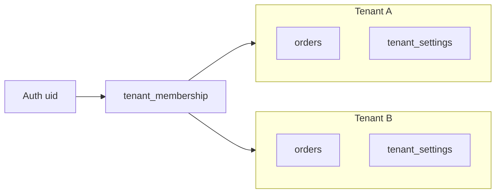

# SaaS OMS — معمارية مشروع جديد (Greenfield)

هذا المستند يصف **مشروعاً مستقلاً** (ريبو جديد + مشروع Firebase جديد): نظام إدارة طلبات أونلاين متعدد المستأجرين (SaaS)، مع مسار طلب كامل، تكامل WooCommerce وBosta، ولوحات إدارة وتحليلات.

---

## 1) مبدأ الـ SaaS

- كل سجل تشغيلي يحمل **`tenantId`** ثابتاً يحدد الشركة/الحساب.
- المستخدم يرتبط بواحد أو أكثر من المستأجرين عبر **`users/{uid}`** و/أو **`tenant_memberships`** (حسب نموذج الدعوات لاحقاً).
- **لا قراءة ولا كتابة عبر المستأجرين**: القواعد والاستعلامات تفرض `tenantId == caller.tenantId` (أو عضوية صريحة).
- تكاملات خارجية (**WooCommerce، Bosta، الفواتير**) تُخزَّن **لكل مستأجر** (إعدادات مشفّرة في Secret Manager أو حقول مؤمّنة لا تُقرأ من العميل إلا لمن يملك صلاحية `integrations.manage`).



---

## 2) هيكل Firestore مقترح

| المسار | الغرض |
|--------|--------|
| `tenants/{tenantId}` | اسم، خطة، حدود، حالة الاشتراك، معرفات خارجية |
| `users/{uid}` | بريد، `defaultTenantId`، تفضيلات |
| `tenant_members/{tenantId}/members/{uid}` | دور داخل المستأجر، دعوة، `joinedAt` |
| `orders/{orderId}` | طلب كامل + `tenantId` + مراحل الـ pipeline + حقول الدفع |
| `orders/{orderId}/events/{eventId}` | سجل النشاط (append-only) |
| `shipments/{shipmentId}` | `tenantId`, `orderId`, `awb`, `shipping_fees`, حالة Bosta |
| `oms_settings/{tenantId}` | إعدادات سلوكية: `auto_create_shipment`, `create_shipment_stage`, إلخ |
| `integration_credentials/{tenantId}` | مراجع لأسرار فقط؛ المفاتيح الحساسة في Secret Manager |
| `analytics_daily/{tenantId}_{date}` | (اختياري) تجميعات للوحات التحكم لتقليل التكلفة |

**مفاتيح منع التكرار:** مثل `woocommerceOrderKey = "${tenantId}_${wcOrderId}"` في الحقل أو مجموعة فهرسة مساعدة إن لزم.

---

## 3) المصادقة والأدوار

- أدوار مقترحة: `admin`, `moderator`, `confirmation`, `invoicing`, `warehouse` (قابلة للتوسع).
- الصلاحيات كـ خريطة boolean في `tenant_members` أو عبر `roles/{roleId}` لكل مستأجر.
- **Cloud Functions** التي تغيّر حالة الطلب أو تنشئ شحنة تتحقق من الدور **في الخادم**، لا تعتمد على واجهة العميل فقط.

---

## 4) مسار الطلب (State machine)

الحالات (مثال): `pending_confirmation` → `confirmed` → `invoicing` → `ready_for_warehouse` → `packed` → `shipped` → `delivered` → `follow_up`.

- انتقالات مسموحة تُعرَّف في كود مشترك (`packages/shared`) وتُنفَّذ في **transaction** أو **Function** واحدة.
- عند الوصول لمرحلة مضبوطة في `oms_settings` (مثل `confirmed` أو `invoiced`): إن كان `auto_create_shipment == true`، استدعاء Bosta وتسجيل `shipments` + `events`.

---

## 5) الدفع و COD

حقول مقترحة على `orders`:

- `payment_status`: `paid` | `partial` | `cod`
- `order_total`, `paid_amount`, `remaining_amount`
- منطق COD: كما في المواصفات (مدفوع بالكامل → 0، جزئي → المتبقي، cod → الإجمالي).

التحقق من الأرقام يحدث عند **التأكيد** في الـ backend.

---

## 6) التكاملات

### WooCommerce

- Webhook HTTPS → Function تتحقق من التوقيع لكل مستأجر (`consumer_secret` أو secret مخصص).
- استخراج `tenantId` من مسار URL أو رأس مخصص **موقّع** (يُفضَّل عدم الاعتماد على query وحدها دون تحقق).

### Bosta

- مفتاح API لكل مستأجر في Secret Manager: مثل `BOSTA_API_KEY_{tenantId}` أو اسم سر ديناميكي ضمن حدود المنصة.
- إنشاء الشحنة وتحديث الحالة من Functions؛ الواجهة لا تستدعي Bosta مباشرة.

---

## 7) المخزن (المسح)

- مسح AWB يربط **شحنة + طلب**؛ التحقق من عدم التكرار وتسجيل كل مسح في `orders/.../events` أو `scan_logs`.
- قواعد: AWB صالح، حالة الطلب تسمح بالمسح، نفس المسح لا يكرر نفس الانتقال.

---

## 8) لوحات الإدارة والتحليلات

- فلترة: `status`, نوع الدفع، المستخدم، نطاق تاريخ، بحث برقم الطلب/الهاتف.
- KPI: إجمالي قيمة الطلبات، المحصّل، المتبقي، إجمالي رسوم الشحن، أعداد حسب الحالة، زمن المراحل.
- مخططات زمنية/حسب الحالة (مثلاً Recharts أو ما يعادله).
- لتقليل القراءات: **rollups يومية** تُحدَّث بـ scheduled function من `orders` و`shipments`.

---

## 9) الأمان والامتثال

- **App Check** للويب.
- قواعد Firestore: أي `read`/`write` على `orders`, `shipments`, `events` يتطابق `resource.data.tenantId` مع عضوية المستخدم.
- تدقيق: `events` و/أو `audit_logs` لكل إجراء حساس.
- خصوصية: لا تسجيل كامل لبيانات بطاقة في Firestore؛ الاكتفاء بما يلزم للتشغيل.

---

## 10) الفوترة SaaS (مستقبل قريب)

- حقول على `tenants`: `plan`, `subscription_status`, `limits.max_orders_per_month`.
- بوابة دفع (Stripe وغيره) تُحدّث `tenants` عبر webhooks؛ Functions ترفض إنشاء طلبات جديدة عند تجاوز الحد أو انتهاء الاشتراك.

---

## 11) Monorepo مقترح

```
apps/web          # واجهة React/Vite أو Next
apps/functions    # Firebase Cloud Functions (TypeScript)
packages/shared   # أنواع، حالات، حساب COD، تعريفات الأدوار
```

---

## 12) قائمة تحقق عند الإطلاق

- [ ] كل collection تشغيلية فيها `tenantId` وفهارس مركبة `(tenantId, status, createdAt)` حسب الاستعلامات.
- [ ] قواعد Firestore تمنع القراءة عبر المستأجرين؛ اختبار بحسابين.
- [ ] Webhook WooCommerce يختبر idempotency (إعادة نفس الحدث).
- [ ] إنشاء شحنة Bosta يعمل في بيئة staging لمستأجر تجريبي.
- [ ] لوحة إدارة تعرض أرقاماً متسقة مع مصدر الحقيقة (بدون حساب مالي من الواجهة فقط).

---

## 13) علاقة هذا المستند بالريبو الحالي

`production-line` يستخدم نمط `tenantId` في أجزاء من النظام؛ **المشروع الجديد** يبدأ بدون Legacy وبدون `sameTenantOrLegacyRead`. يمكن نسخ الأفكار التشغيلية (مثل حدود يوم العمل للتواريخ) دون نسخ الجداول القديمة.

---

*آخر تحديث: وثيقة مخطط — تُحدَّث عند اعتماد أسماء الحقول النهائية وواجهات API التكامل.*
