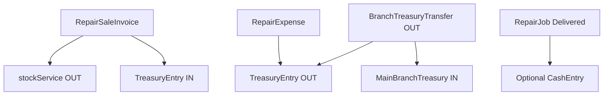

# تقرير مراجعة فجوات موديول الصيانة

## الملخص التنفيذي
- التغطية الحالية: **7 صفحات مكتملة** من أصل 11.
- الصفحات غير المنفذة: **لوحة الأدمن للصيانة، الخزينة، فاتورة بيع قطع الغيار، تتبع العميل العام `/track`**.
- التكامل المالي الحالي داخل المشروع **جزئي** (Payroll disbursement + مخزون) ولا يوجد Ledger/خزينة موحدة بعد.
- أقوى نقطة جاهزة للتكامل الآن: طبقة المخزون (`stock_transactions`) + طبقة قطع الغيار بالصيانة (`repair_parts_transactions`).

## مصفوفة التغطية (11 صفحة)
| الصفحة المطلوبة | الحالة | الموجود حاليًا |
|---|---|---|
| لوحة الأدمن (كارت لكل فرع + KPIs كاملة) | غير موجودة | لا يوجد Route/Page مخصص للصيانة على مستوى الأدمن |
| لوحة الصيانة | موجودة بالكامل | `modules/repair/pages/RepairDashboard.tsx` |
| طلبات الصيانة (بحث فوري) | موجودة بالكامل | `modules/repair/pages/RepairJobs.tsx` + `modules/repair/hooks/useRepairJobs.ts` |
| جهاز جديد (إيصال تلقائي) | موجودة بالكامل | `modules/repair/pages/NewRepairJob.tsx` + `modules/repair/services/repairReceiptService.ts` |
| تفاصيل الطلب (حالة + قطع + PDF + واتساب) | موجودة بالكامل | `modules/repair/pages/RepairJobDetail.tsx` |
| مخزن قطع الغيار (تنبيه popup + صوت) | موجودة بالكامل | `modules/repair/pages/SparePartsInventory.tsx` + `modules/repair/hooks/useLowStockAlert.ts` |
| الفروع (تعيين فني لأكثر من فرع) | موجودة بالكامل | `modules/repair/pages/RepairBranches.tsx` |
| أداء الفنيين (KPIs + نجاح + Progress) | موجودة جزئيًا | `modules/repair/pages/RepairTechnicianKPIs.tsx` (KPIs موجودة، Bar progress غير موجود) |
| الخزينة (فتح/تقفيل + مصاريف + تحويل للرئيسي) | غير موجودة | لا يوجد route/page/service مخصص |
| فاتورة بيع قطع بدون طلب صيانة | غير موجودة | لا يوجد route/page/service مخصص |
| تتبع العميل `/track` (بدون لوجين) | غير موجودة | لا يوجد Public Route أو صفحة تتبع |

## ما تم التحقق منه (Code Evidence)
- راوتات الصيانة الحالية: `modules/repair/routes/index.ts`.
- ظهور الصيانة في القائمة والصلاحيات: `config/menu.config.ts`, `utils/permissions.ts`.
- الكيانات الأساسية: `modules/repair/types.ts`, `modules/repair/collections.ts`.
- خدمات التشغيل: `modules/repair/services/repairJobService.ts`, `modules/repair/services/sparePartsService.ts`, `modules/repair/services/repairBranchService.ts`.
- لا يوجد Route عام `/track` في التطبيق الحالي (`App.tsx`).

## نقاط التكامل المالي الحالية (Baseline)
### 1) مخزون وحركات أصناف جاهزة للاعتماد
- توجد حركات مخزون عامة في `modules/inventory/services/stockService.ts` عبر `stock_transactions`.
- توجد حركات خاصة بقطع الصيانة في `modules/repair/services/sparePartsService.ts` عبر `repair_parts_transactions`.
- هذا يتيح ربط **فاتورة بيع قطع** بحركة OUT من المخزون الحالي بدون اختراع نظام مخزون جديد.

### 2) تدفقات صرف موجودة لكن ليست خزينة عامة
- صرف الرواتب/السلف موجود (`modules/hr/pages/PayrollAccounts.tsx`, `modules/hr/loanService.ts`) لكنه ليس نظام خزينة موحد للفروع.
- لا يوجد دفتر خزينة عام (Open/Close shift, cash in/out, branch transfer ledger).

### 3) الفروع لديها ربط مخزن تلقائي
- إنشاء فرع صيانة يولد مخزنًا (`modules/repair/services/repairBranchService.ts` + `warehouseService`)، وهي نقطة قوية لبناء:
  - فاتورة بيع قطع → خصم مخزون الفرع.
  - الخزينة → ربط حركة نقدية بنفس الفرع.

## فجوات تفصيلية حسب الصفحة (Priority + Risk)
### High
1. **لوحة الأدمن للصيانة**
   - الفجوة: لا يوجد تجميع KPIs per branch على مستوى الإدمن.
   - المخاطر: ضعف رؤية الإدارة متعددة الفروع.

2. **الخزينة**
   - الفجوة: لا توجد كيانات/شاشة فتح-تقفيل/مصروفات/تحويل.
   - المخاطر: فقدان تتبع النقد اليومي وعدم وجود إقفال.

3. **فاتورة بيع قطع**
   - الفجوة: لا يوجد بيع مباشر خارج طلب الصيانة.
   - المخاطر: خصم مخزون غير موثق أو تسعير/تحصيل خارج النظام.

4. **تتبع العميل `/track`**
   - الفجوة: لا صفحة عامة ولا endpoint/lookup policy.
   - المخاطر: تجربة عميل ناقصة + ضغط على خدمة العملاء.

### Medium
5. **أداء الفنيين**
   - الفجوة: لا يوجد progress bar بصري في الجدول، أسماء الفنيين معتمدة غالبًا على id.
   - المخاطر: قراءة KPI أقل وضوحًا للإدارة.

### Low
6. **تحسينات جودة البيانات**
   - تطبيع naming بين `repair.parts_transactions` و`stock_transactions`.
   - تحسين audit fields (createdById / createdByName بشكل ثابت).

## تصميم تكامل مالي مقترح (بدون كسر الموجود)

- فاتورة البيع: تسجل سطر بيع + تخصم الكمية من مخزون الفرع + تسجل قبض نقدي في الخزينة.
- الخزينة: تسجل حركات نقدية معيارية (IN/OUT/TRANSFER) مع branch scope.
- التسليم من طلب الصيانة: يمكن جعله حركة قبض اختيارية أو إلزامية حسب سياسة التشغيل.

## تغييرات الملفات المتوقعة لكل جزء (عند التنفيذ)
### Admin Dashboard (Repair)
- `modules/repair/pages/RepairAdminDashboard.tsx` (جديد)
- `modules/repair/routes/index.ts` (إضافة route)
- `config/menu.config.ts` (إضافة عنصر/تقييد رؤية الإدمن)
- `utils/permissions.ts` (صلاحية `repair.adminDashboard.view`)

### Treasury
- `modules/repair/pages/RepairTreasury.tsx` (جديد)
- `modules/repair/services/repairTreasuryService.ts` (جديد)
- `modules/repair/types.ts` (إضافة أنواع treasury session/entry)
- `modules/repair/collections.ts` (إضافة collections للخزينة)

### Spare Parts Sales Invoice
- `modules/repair/pages/RepairSalesInvoice.tsx` (جديد)
- `modules/repair/services/repairSalesInvoiceService.ts` (جديد)
- تكامل مباشر مع `modules/inventory/services/stockService.ts`

### Public Track
- `modules/repair/pages/RepairTrackPublic.tsx` (جديد)
- `modules/repair/services/repairTrackService.ts` (جديد/أو إعادة استخدام)
- `App.tsx` (إضافة route عام `/track`)
- قواعد Firestore: إتاحة قراءة محدودة بــ receipt + phone hash/token

## مراحل التنفيذ المقترحة
### Phase 1 (Core Revenue + Customer)
1. فاتورة بيع قطع الغيار.
2. تتبع العميل `/track`.
3. تحسين صفحة أداء الفنيين (progress + technician name resolution).

**مخرج المرحلة:** بيع مباشر + تجربة عميل خارجية + رفع جودة تقارير الأداء.

### Phase 2 (Finance Control)
1. شاشة الخزينة كاملة (فتح/تقفيل/مصروفات/تحويل رئيسي).
2. ربط اختياري لتحصيل التسليم من طلب الصيانة بالخزينة.
3. ضوابط صلاحيات وتدقيق.

**مخرج المرحلة:** رقابة نقدية يومية على مستوى الفروع.

### Phase 3 (Executive View)
1. لوحة أدمن صيانة متعددة الفروع.
2. KPIs مقارنة بين الفروع + تنبيهات.

**مخرج المرحلة:** رؤية إدارية مركزية للصيانة.

## الاعتمادات (Dependencies)
- فاتورة البيع تعتمد على:
  - وجود فرع + مخزن مرتبط.
  - سياسات تسعير/خصم/ضريبة واضحة.
- تتبع العميل يعتمد على:
  - سياسة أمان للوصول العام (token أو تحقق مزدوج).
- الخزينة تعتمد على:
  - توحيد نموذج الحركات النقدية للفرع والرئيسي.
- لوحة الأدمن تعتمد على:
  - استقرار Data contracts للطلبات/المخزون/الخزينة.

## مخاطر التنفيذ
- **أمني:** نشر `/track` بدون ضوابط قد يكشف بيانات حساسة.
- **محاسبي:** تسجيل تحصيل في أكثر من مكان بدون مصدر واحد للحقيقة.
- **تشغيلي:** فروقات مخزون إذا تم البيع بدون transaction موحدة.
- **صلاحيات:** خلط صلاحيات الفني/الكاشير/الإدمن.

## توصية ختامية
- ابدأ بـ **Phase 1** لأنه يعطي أثرًا مباشرًا للعملاء والإيراد مع تعقيد أقل.
- نفّذ الخزينة كطبقة مالية مستقلة في Phase 2 مع تكامل مضبوط.
- اختم بلوحة الأدمن بعد استقرار مؤشرات البيانات.
